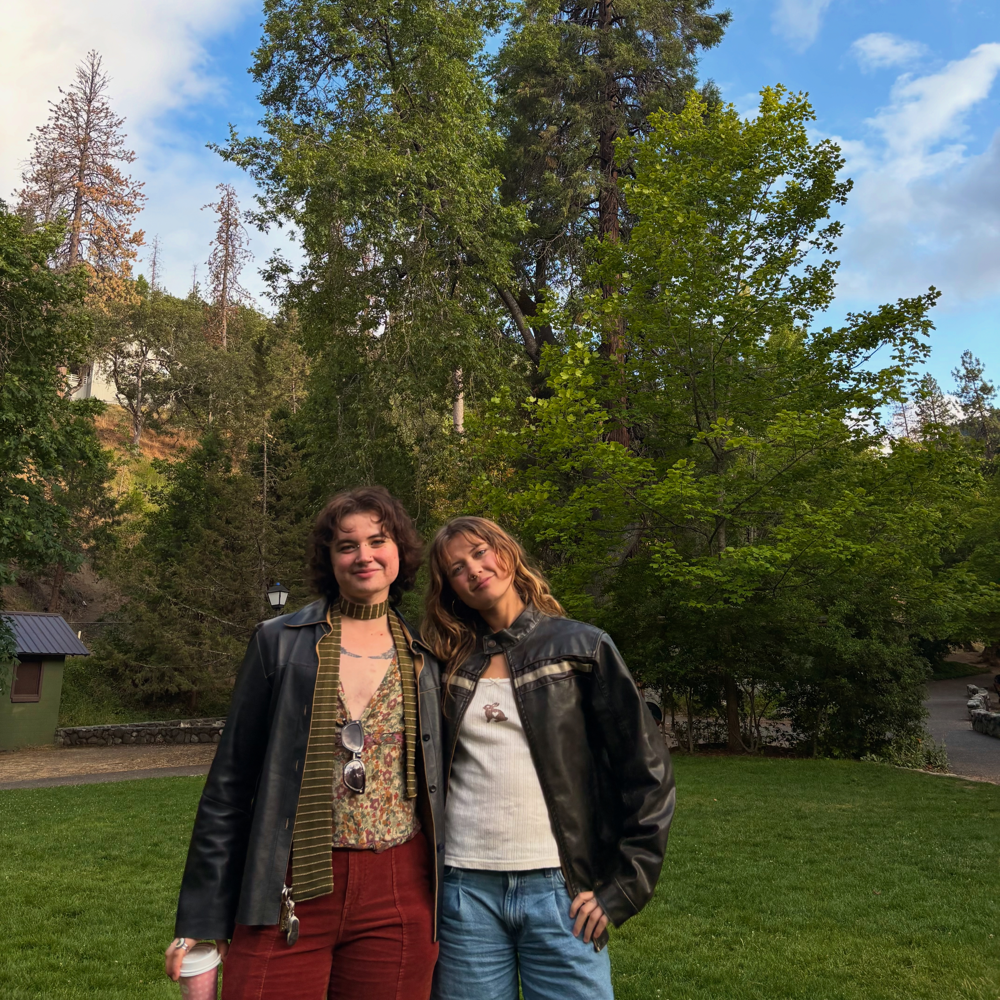
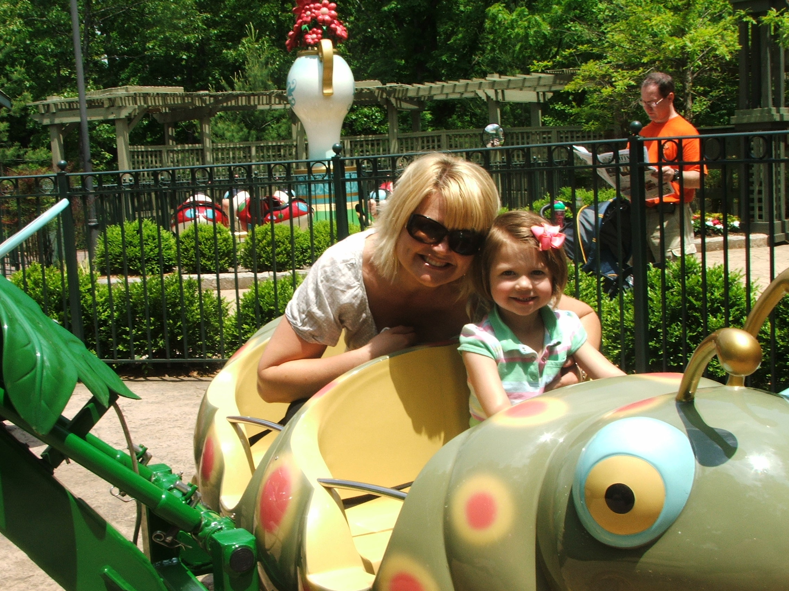
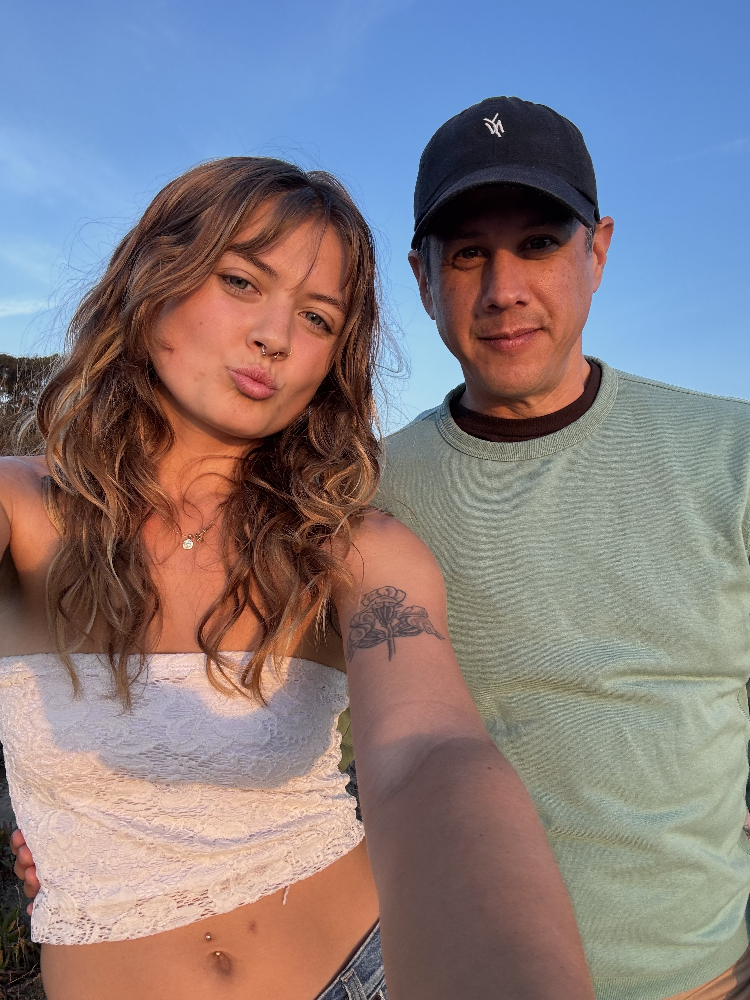
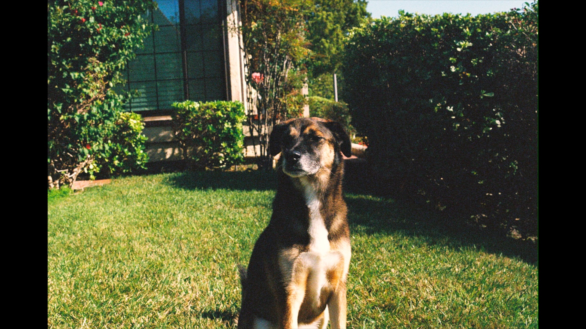
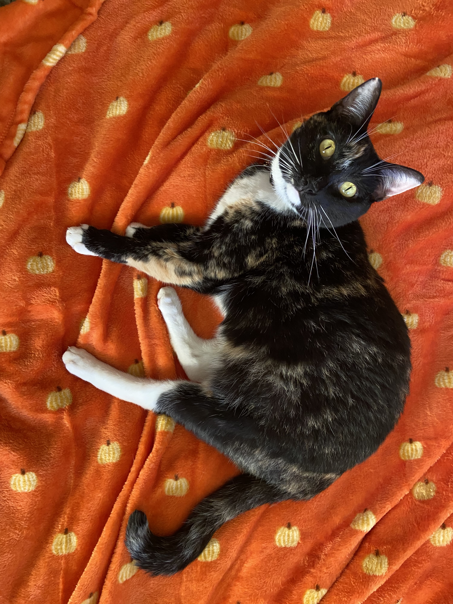
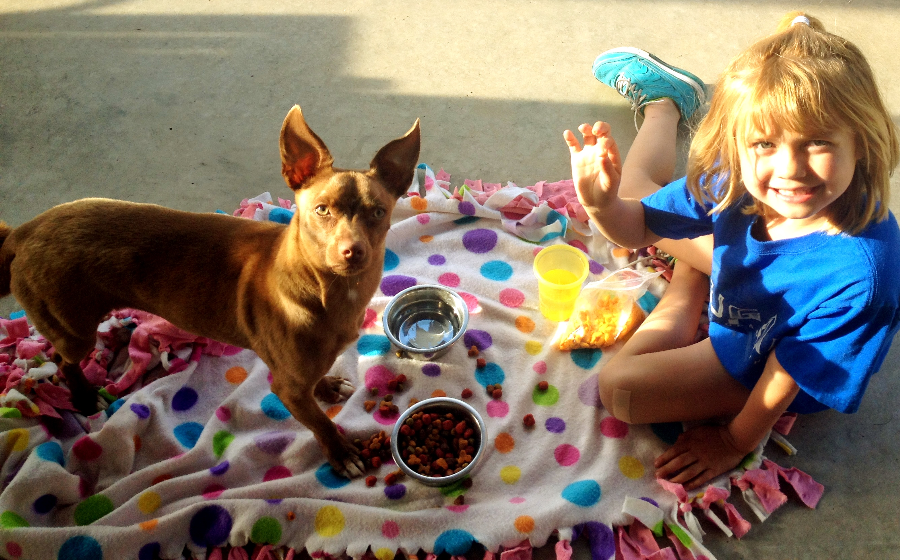
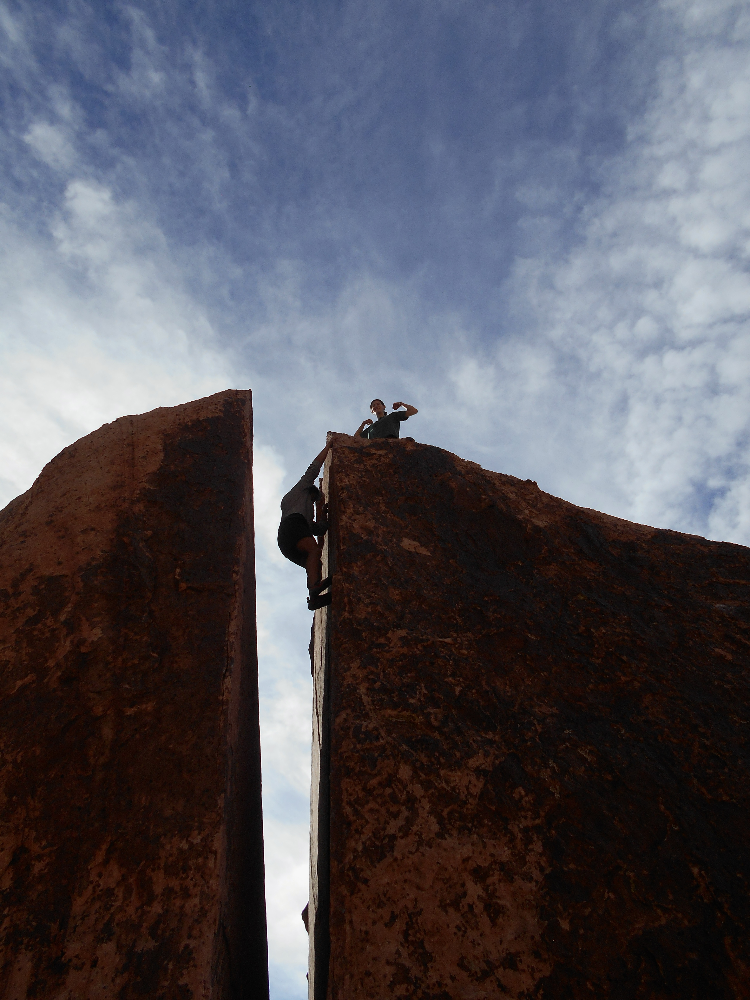
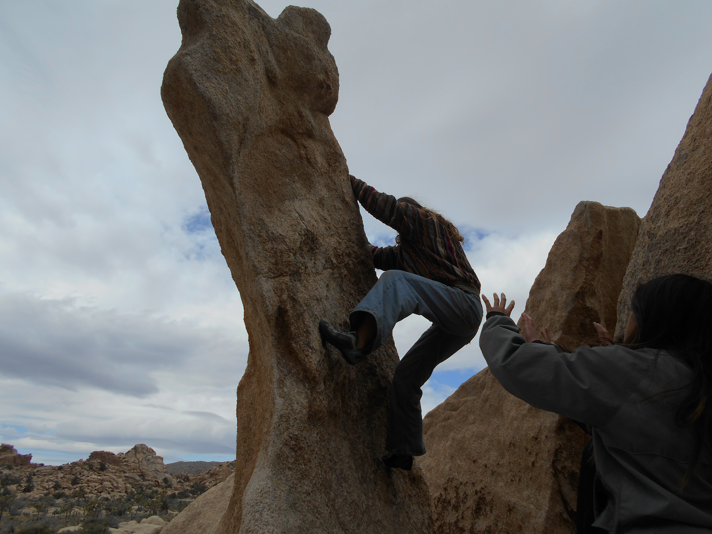
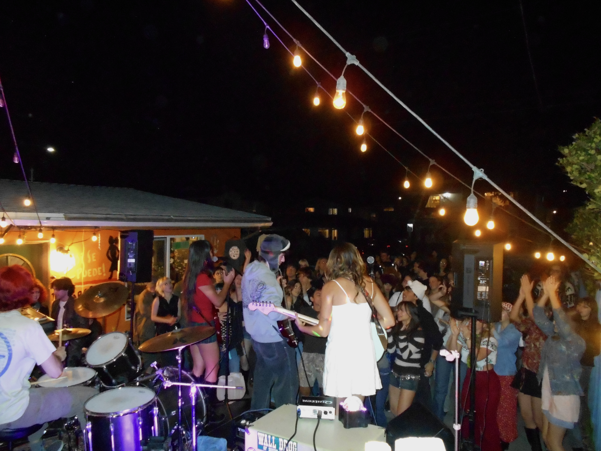

## My Background

I was born in Oregon and have since lived in Kansas, Arizona, and California. I grew up alongside my brother, Cameron, who is now a professional tattoo artist in Oregon. My family loves amusement parks, playing games, and going to cafés. 

   

I have two pets at home, a cat named Phoebe and dog named Nova. My childhood dog, Bono, recently passed away and is very missed and loved. 

  

## Climbing 
I joined the UCSB climbing team this fall and have since then been on trips to Bishop, Red Rocks, and Joshua Tree. I primarily boulder and the highest gym grade I have completed is a V5, my highest outdoor grade a V2. 

 

## Publicity Stunt

This fall I started a band named Publicity Stunt with my friends. We play indie rock covers in Isla Vista and are currently working on an EP. I sing and play rhythm guitar and write lyrics for the band. 

<a href="https://instagram.com/publi.citystunt" target="_blank" style="text-decoration: none; color: #3C4D03; font-weight: bold; display: inline-flex; align-items: center; gap: 6px; margin-bottom: 15px;">
  <i class="bi bi-instagram"></i> @publi.citystunt
</a>

