I first started film photography when I was 15 years old on a point and shoot my parents got me for Christmas. I love capturing the world, my friends, and even myself through the lens of a camera. Featured in this map are photos taken on my Canon AE-1 on 35mm Kodak gold film. 

```{r}
#| echo: true
#| message: false
#| warning: false


# loading in packages
library(leaflet)
library(tidyverse)

# creating object gps to store photo data 
gps <- read_csv("data/photo_gps_updated.csv")

# creating gps grouped data
gps_grouped <- gps |> 
  group_by(location, latitude, longitude) |> 
  summarize(
    # creating thumbnails 
    popup_content = paste0(
      '<div style="max-width: 280px; text-align: center;">',
        '<h4 style="margin: 0 0 10px 0; font-family: inherit; font-size: 14px;">', unique(location), '</h4>',
        '<div style="display: flex; flex-wrap: wrap; gap: 8px; justify-content: center;">',
          paste0(
          '<div style="text-align: center; width: 100%;">',
              '<a href="images/', filename, '" class="lightbox" data-gallery="map-gallery" title="', desc, '">',
                '',
              '</a>',
              '<p style="margin: 4px 0 0 0; font-size: 12px; color: #555; font-style: italic; max-width: 200px; margin-left: auto; margin-right: auto;">', desc, '</p>',
            '</div>',
            collapse = ""
          ),
        '</div>',
      '</div>'
    ),
    .groups = "drop"
  )

# generate the interactive map layout
site_map <- leaflet(data = gps_grouped) |>  
  
  # Add base map layers
  addProviderTiles(providers$Esri.WorldImagery, group = "ESRI World Imagery") |>  
  addProviderTiles(providers$Esri.OceanBasemap, group = "ESRI Oceans") |> 
  
  # add mini map
  addMiniMap(toggleDisplay = TRUE, minimized = TRUE) |> 
  
  # Center map at Isla Vista area
  setView(lng = -119.83, lat = 34.44, zoom = 10) |> 
  
# add location bubbles and markers 
  addMarkers(clusterOptions = markerClusterOptions(),
             lng = ~longitude, lat = ~latitude,
             popup = ~popup_content) |> 

  # add layers control 
  addLayersControl(
    baseGroups = c("ESRI World Imagery", "ESRI Oceans"))

# print map 
site_map
```

<div style="display: none;">
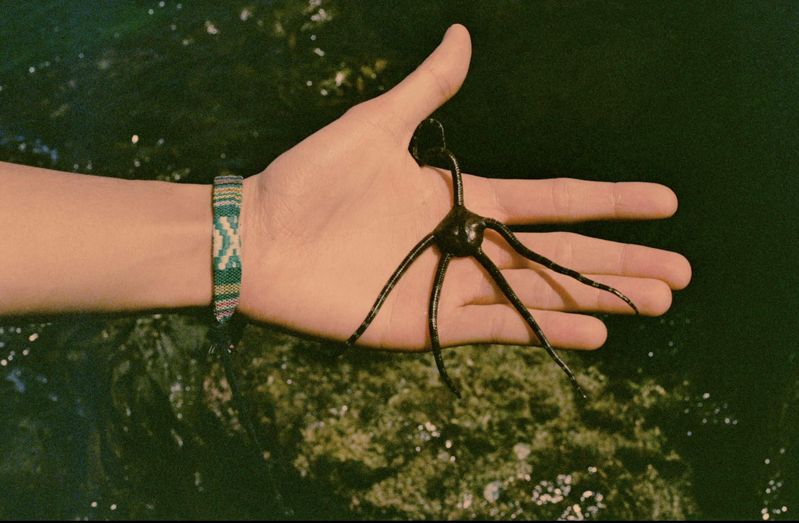
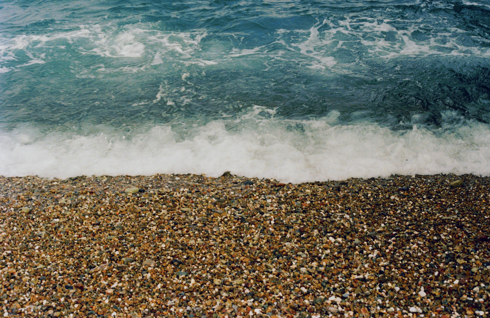
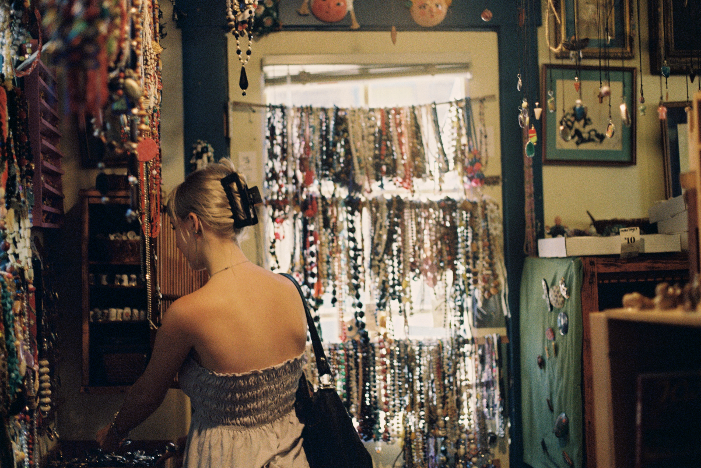
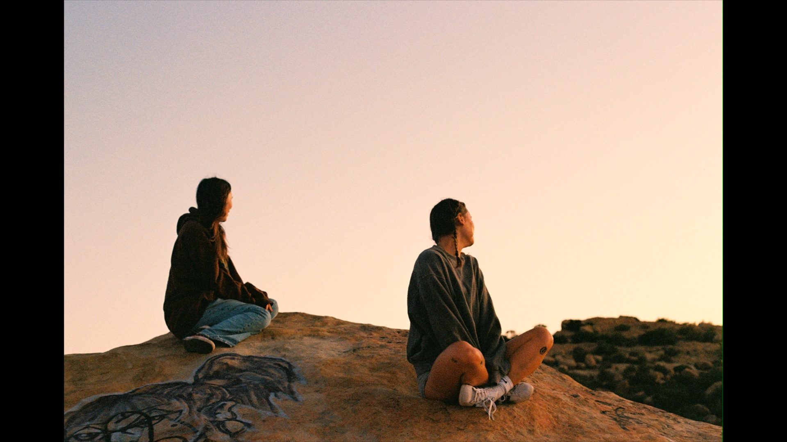
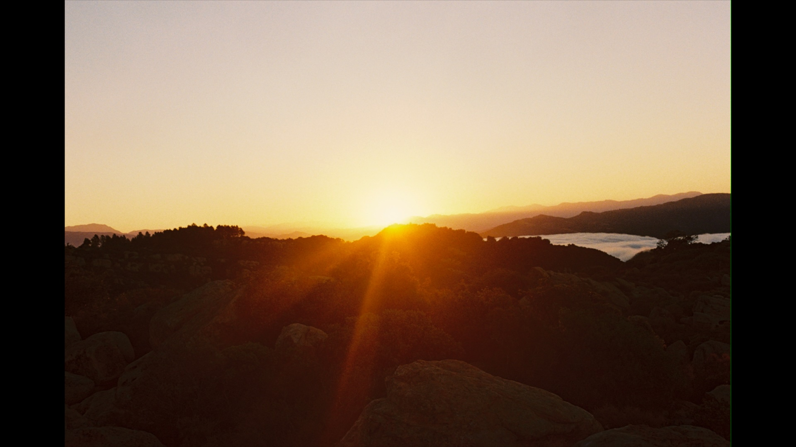
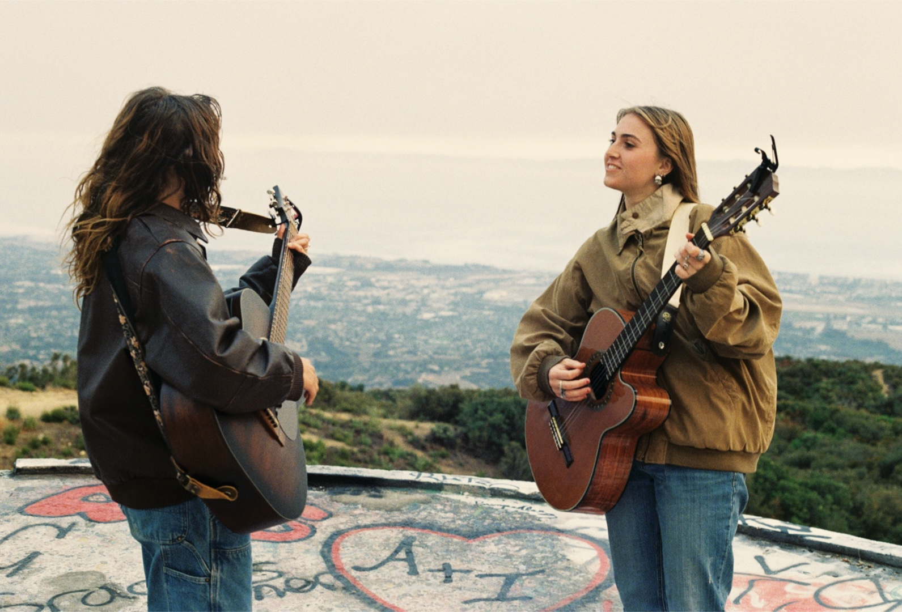
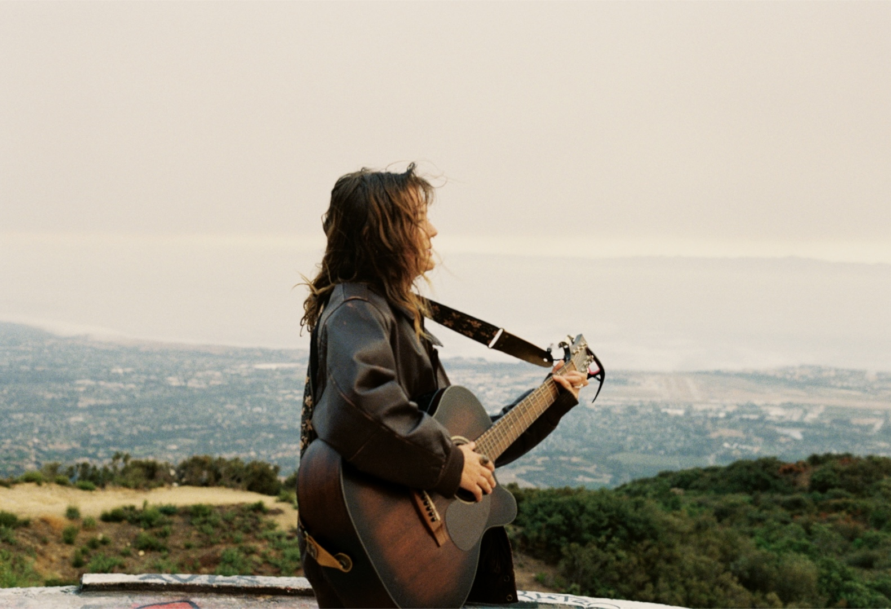
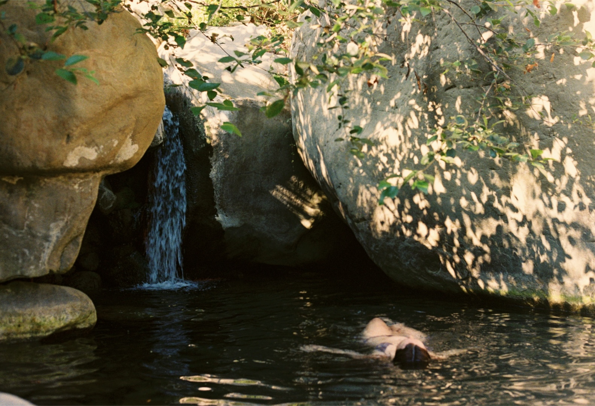

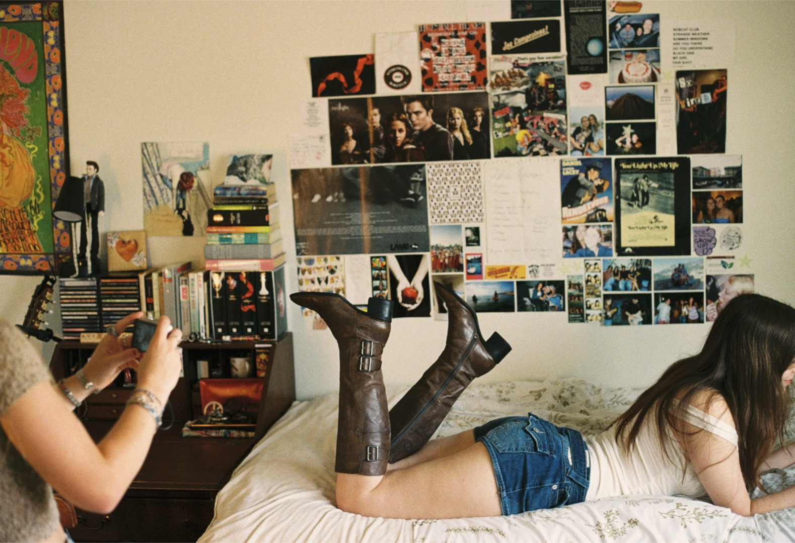
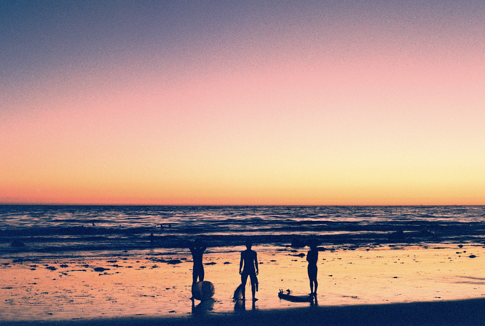
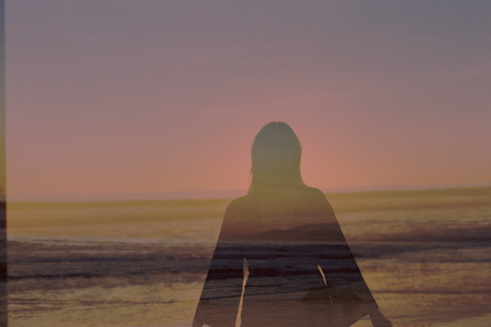
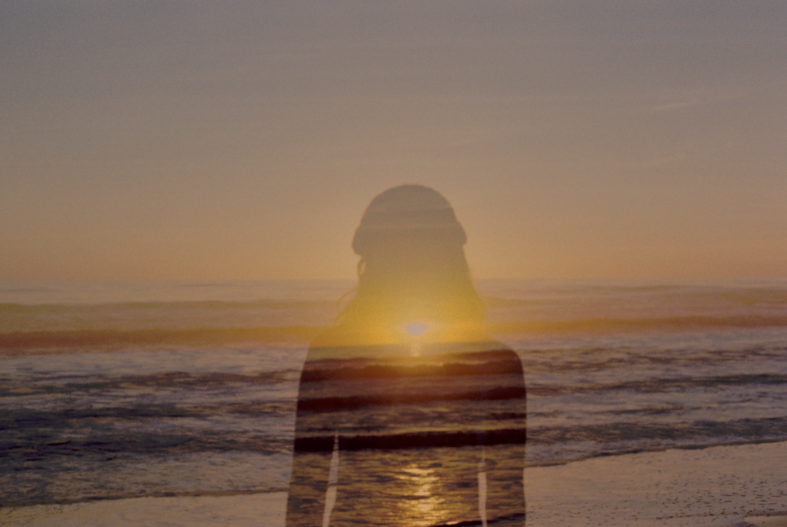
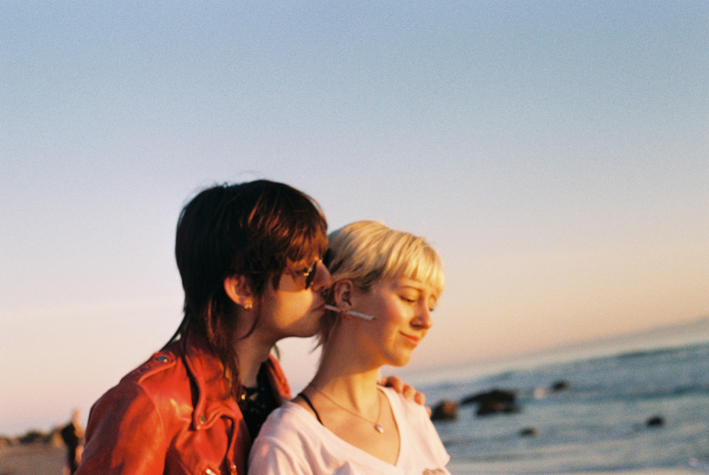

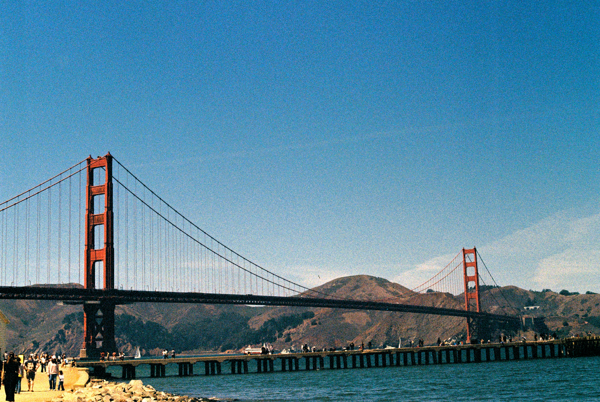
</div>