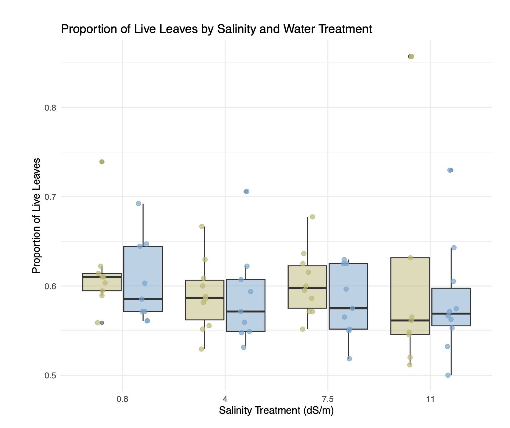

### *Stipa pulchra* Greenhouse Experiment 

Spring quarter 2026 I interned with the Cheadle Center of Biodiversity and Ecological Restoration to help plan and begin a greenhouse experiment. The purpose of this experiment is to test *Stipa pulchra* survivorship in response to varying salinity levels. This experiment is being done to investigate a hypothesis looking at why *Stipa pulchra* has seen die off at the North Campus Open Space restoration site in recent years. The experimental design includes 4 salinity treatments and wet versus dry treatments for 80 individual plants. This experiment is currently ongoing. 

**Proportion of Live Leaves by Salinity and Water Treatment :** Wet treatments are indicated in blue; dry treatments in yellow. Individual observations are represented by points, with box plots displaying the median and interquartile range (IQR) for each treatment group. Data collected by Elise LaFreniere and Abriel Lau; visualization generated by Elise LaFreniere.
