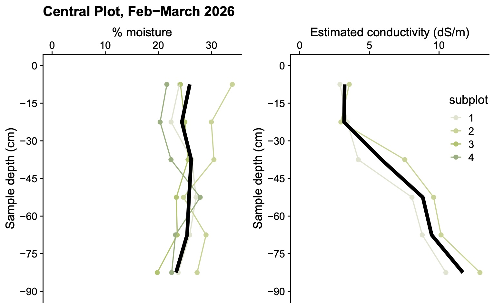

## Internships & Research

### Soil Cores at North Campus Open Space

Winter quarter 2026 I interned with the Cheadle Center of Biodiversity and Ecological Restoration to take a total of 16 soil cores across a control and test site at North Campus Open Space. Each soil core was weighed and the salinity was measured to see how the salinity level has changed from when the site was originally restored to now. 

*My data put into visualization by my research coordinator, Francis Joyce*

### *Stipa pulchra* Greenhouse Experiment 

Spring quarter 2026 I interned with the Cheadle Center of Biodiversity and Ecological Restoration to help plan and begin a greenhouse experiment. The purpose of this experiment is to test *Stipa pulchra* survivorship in response to varying salinity levels. This experiment is being done to investigate a hypothesis looking at why *Stipa pulchra* has seen die off at the North Campus Open Space restoration site in recent years. The experimental design includes 4 salinity treatments and wet versus dry treatments for 80 individual plants. This experiment is currently ongoing. 

*Wet treatment shown in blue coloring, dry in yellow. Individual observations shown in points with box plots displaying the median and IQR for each salinity treatment. Visualization of preliminary data I created utilizing R-studio.*

