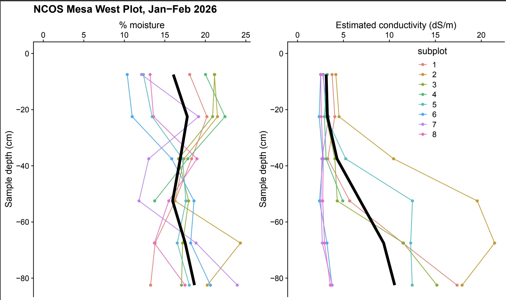

## Internships & Research

### Soil Cores at North Campus Open Space

Winter quarter 2026 I interned with the Cheadle Center of Biodiversity and Ecological Restoration to take a total of 16 soil cores across a control and test site at North Campus Open Space. Each soil core was weighed and the salinity was measured to see how the salinity level has changed from when the site was originally restored to now. 

**NCOS Mesa West Plot, Jan-Feb 2026 :** Both figures depict subplot lines that are differentiated by color, as shown in the legend, both with overarching black trendlines shown. Figure on the left shows the soil moisture change as sample depth increases, and the figure on the right shows how conductivity in dS/m changes as depth increases. Data collected by Elise LaFreniere; visualization generated by Francis Joyce.

**Central Plot Feb-March 2026 :** Preliminary data figure of first four subplots. Lines are differentiated by shade of green, as shown in the legend, both with overarching black trendlines shown. Figure on the left shows the soil moisture change as sample depth increases, and the figure on the right shows how conductivity in dS/m changes as depth increases. Data collected by Elise LaFreniere; visualization generated by Francis Joyce.

### *Stipa pulchra* Greenhouse Experiment 

Spring quarter 2026 I interned with the Cheadle Center of Biodiversity and Ecological Restoration to help plan and begin a greenhouse experiment. The purpose of this experiment is to test *Stipa pulchra* survivorship in response to varying salinity levels. This experiment is being done to investigate a hypothesis looking at why *Stipa pulchra* has seen die off at the North Campus Open Space restoration site in recent years. The experimental design includes 4 salinity treatments and wet versus dry treatments for 80 individual plants. This experiment is currently ongoing. 

**Proportion of Live Leaves by Salinity and Water Treatment :** Wet treatments are indicated in blue; dry treatments in yellow. Individual observations are represented by points, with box plots displaying the median and interquartile range (IQR) for each treatment group. Data collected by Elise LaFreniere and Abriel Lau; visualization generated by Francis Joyce.

